 

 
 

---

## 👨‍💻 About Me

 

I’m **Abdul Basit**, a **Full Stack React Native Developer** focused on building practical, scalable, and polished mobile applications.

My work is mostly around **React Native**, **Expo**, **Firebase**, **API integrations**, and **Web3/blockchain-based mobile products**. I like building apps that feel smooth, are easy to use, and actually solve real problems.

- 📱 Specialized in **React Native CLI** and **Expo**
- 🔥 Experienced with **Firebase**, **real-time apps**, **push notifications**, and **API integrations**
- 🔗 Worked on **crypto wallets**, **blockchain flows**, and **Web3 features**
- 🤖 Interested in **AI-powered mobile experiences**
- 🎮 Exploring **Game Development** and **Data Science**
- ⚡ Focused on performance, clean UI, and production-ready app architecture

 

---

## ✦ Core Expertise

<table>
  <tr>
    <td align="center">
      <h3>
        Building polished mobile products with clean architecture, real-time systems, Web3 flows, and smooth user experiences.
      </h3>
      

        A focused mix of mobile engineering, performance optimization, Firebase workflows, blockchain integrations, and production-ready UI execution.
      

    </td>
  </tr>
</table>

 

<table>
  <tr>
    <td width="50%" valign="top">
      <h3>📱 Mobile Product Engineering</h3>
      

        I build cross-platform Android and iOS apps using <b>React Native</b> and <b>Expo</b>, with clean architecture, reusable components, smooth navigation, and production-ready foundations.
      

      

        
        
        
      

    </td>
    <td width="50%" valign="top">
      <h3>⚡ Real-Time Systems</h3>
      

        I design real-time app experiences such as chat, push notifications, live sync, presence states, and media workflows using scalable services like <b>Firebase</b> and event-driven app patterns.
      

      

        
        
        
      

    </td>
  </tr>
  <tr>
    <td width="50%" valign="top">
      <h3>🔐 Web3 & Crypto Products</h3>
      

        I work on crypto wallet flows, blockchain integrations, transaction handling, payments, and <b>Web3-powered mobile experiences</b> that bridge modern apps with decentralized functionality.
      

      

        
        
        
      

    </td>
    <td width="50%" valign="top">
      <h3>🎨 UI, UX & Performance</h3>
      

        I turn Figma designs into polished interfaces while improving rendering, caching, responsiveness, and overall app feel—so the final product looks refined and performs smoothly in real use.
      

      

        
        
        
      

    </td>
  </tr>
</table>

---

## 🛠️ Tech Stack & Tools

 
 

---

## 🚀 What I Build

| Area | What I Do |
| --- | --- |
| 📱 Mobile Apps | Cross-platform Android and iOS apps with React Native |
| 🔐 Crypto Wallets | Wallet flows, blockchain integrations, payments, and Web3 features |
| ⚡ Real-Time Apps | Chat apps, live updates, notifications, and sync-based experiences |
| 🔥 Firebase Apps | Firestore, Authentication, Cloud Storage, FCM, and real-time databases |
| 🤖 AI Solutions | AI-integrated mobile experiences and smart app workflows |
| 🎮 Game Experiments | Unity-based game ideas and interactive experiences |
| 🎨 UI Implementation | Pixel-perfect screens from Figma to production-ready apps |

---

## 📊 GitHub Overview

 
 

 
 

---

## 🏅 Highlights

---

## ⚡ Current Focus

 
 

<table>
  <tr>
    <td width="33%" align="center" valign="top">
      <h3>⚡ Performance</h3>
      

        React Native optimization, smoother rendering, better list performance, local caching, and faster app interactions.
      

      
    </td>
    <td width="33%" align="center" valign="top">
      <h3>🔐 Blockchain</h3>
      

        Advanced wallet flows, transaction handling, Web3 integrations, and blockchain-powered mobile features.
      

      
    </td>
    <td width="33%" align="center" valign="top">
      <h3>💬 Real-Time</h3>
      

        Scalable chat architecture, live sync, push notifications, media handling, and presence-based app experiences.
      

      
    </td>
  </tr>
  <tr>
    <td width="33%" align="center" valign="top">
      <h3>🤖 AI Features</h3>
      

        AI-powered app workflows, smarter user experiences, assistant-like features, and practical automation inside mobile apps.
      

      
    </td>
    <td width="33%" align="center" valign="top">
      <h3>🏗️ Architecture</h3>
      

        Cleaner app structure, scalable state management, reusable components, API layers, and maintainable project patterns.
      

      
    </td>
    <td width="33%" align="center" valign="top">
      <h3>🎨 Product UI</h3>
      

        Clean interface execution, polished Figma-to-app screens, responsive layouts, and better user experience details.
      

      
    </td>
  </tr>
</table>

 

---

## 🌐 Connect With Me

---

## 🐍 Contribution Snake

<picture>
  <source media="(prefers-color-scheme: dark)" srcset="https://raw.githubusercontent.com/Abdul-Basitt1/Abdul-Basitt1/output/github-contribution-grid-snake-dark.svg" />
  <source media="(prefers-color-scheme: light)" srcset="https://raw.githubusercontent.com/Abdul-Basitt1/Abdul-Basitt1/output/github-contribution-grid-snake.svg" />
  
</picture>

---

